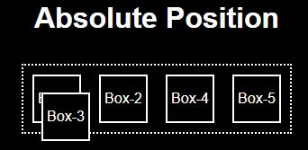
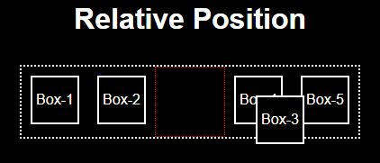
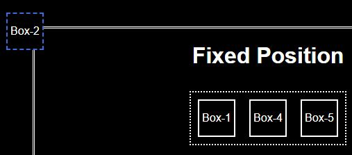
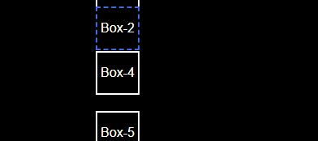

# CSS

1.  Whats Box Model in CSS & Which CSS Properties are part of it ?

    Ans:- CSS consider very element as box. it has following properties padding,border size,margin
    padding is space between content and border. border size decide the size of border. margin is space between html elements

2.  What are the Different Types of Selectors in CSS & what are the advantages of them?

    Ans:-

    1. Class Selector: class selector elements which has the specific class attribute. The style will apply to all element which has this class

    2. Id Selector: It select only one element which has specified id. It is used to find unique element.

    3. Element selector: It select element based on it name(tag);

    4. Universal Selector: It select everything from html. It is used to apply common style for webpage.

    5. Grouping Selector: it selects all specified elements.It is used to give common style for multiple elements. A, B : It selects all A and B elements

    6. Child Selector: It selects the elements from parent to child.
       A>B : It select B which is inside of A

3.  What is VW/VH & How its different from PX?

    Ans:- VW/VH- View width/height- Total available viewport width/height. 1 vw= 1% of available viewport width/height. it varies as per device viewport. where as PX is fixed unit. It reman same on all devices.

4.  Whats difference between Inline, Inline Block and block ?

    Ans:-

    1. Inline - It take width/height as per the content we can't set width/height.
    2. Inline-Block - here we can set height and width of element.
    3. Block- It take all width of page.

5.  How is Border-box different from Content Box?

    Ans:-

    1. Border-Box-: height and width is applied to whole box of element with includes padding and border size.
    2. content-box: Height and width is applied to content .

6.  What’s z-index and How does it Function ?

    Ans:- Z-index gives element position reference to its Z axis. Higher is the index means is is closer to the screen.

7.  What’s Grid & Flex and difference between them?

    Ans:-
    flex and grid are layout properties in css.

    | Flex                                                         | Grid                                                              |
    | :----------------------------------------------------------- | :---------------------------------------------------------------- |
    | It is one-dimensional layout                                 | It is two-dimensional layout                                      |
    | element can be arranged in row or column                     | element can be arranged in specified rows and columns             |
    | element position is automatic or as per flow                 | element can be placed at specified position. It give more control |
    | Flex tries to fit content in container. It focus on content. | grid focus on layout then place content there                     |
    | Flex has less control over position and alignment of content | Grid has more control over position and alignment of content      |

8.  Difference between absolute and relative and sticky and fixed position explain with
    example

        Ans:-
        1. Absolute Position: It takes the position with respect to window or its parent which has position as relative.
        
        2. relative Position: It takes the position with respect to it original position as per html document flow.
        
        3. Fixed Position : It take the position with respect to window and it come out of document flow and scrolling will not have any effect on it.
        
        4. Sticky position : when the element appear in window it will take position with respect to window and become fixed. It will scroll till it appears on window.
        

9.  Build Periodic Table as shown in the below image

    Ans:-

    1. [Live Demo](https://charming-torrone-d5432f.netlify.app/)
    2. [Code](perodictable.html)

10. Build given layout using grid or flex see below image for reference

    Ans:-

    1. [Live Demo](https://stalwart-kelpie-33ef9c.netlify.app/)
    2. [Code](q9.html)

11. Build Responsive Layout both desktop and mobile and Tablet, see below image for
    reference ?

         Ans:- buit responsive landing page  [Link](https://ui-design-project-apjcr.netlify.app/ch-15-huddle-landing-page/)

12. Build Complete Homepage of Ineuron with responsiveness.

    Ans:- Inted of ineuron built this one [Link](https://ui-design-project-apjcr.netlify.app/ch-14-clipboard-landing/)

13. What are Pseudo class in CSS & How its different From Pseudo Elements?

    Ans:- Pesudeo element(before, after) add new content to tag where pesudo class give information about element state.
