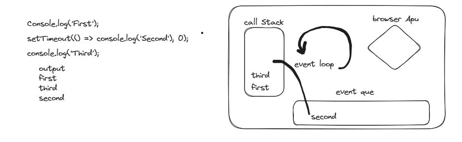
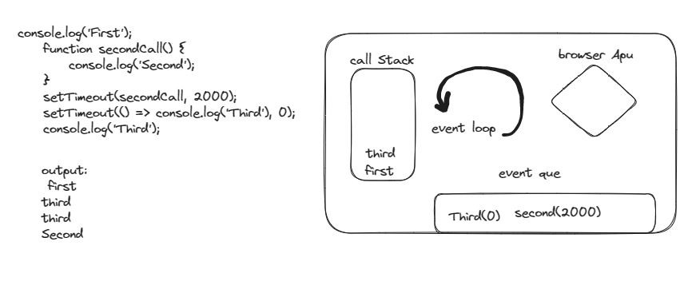

# Javascript

1.  What is Hoisting in Javascript ?

    Ans:- The hoisting is js mechanism where function and variable declaration is moved to to of the scope. so the function will be available at top of scope. the variable declared with var is initialized with undefined.

2.  What are different higher order functions in JS? What is the difference between .map() and .forEach() ?

    Ans:- map function return new array after performing specified logic. foreach just iterate through array and perform specified some logic it return undefined.

3.  What is the difference between .call() .apply() and .bind()? explain with an example

    Ans:- call,apply,bind are used to chang the context of function or we can barrow function from another object.

    1. call: It will take new context and arguments by comma separated value and function will be executed.
    2. Apply: It will take new context and arguments by array values and function will be executed
    3. bind: It will take new context and bind it with variable, so it can be executed whenever needed.

    ```
    const mainObj = {
        name: "akshay",
        lastname: "jadhav",
        fullname: function (age, height) {
            return ` The full name ${this.name} ${this.lastname} age:${age} height: ${height}cm `
        }
    }
    const neObj = {
        name: "akku",
        lastname: "apj"

    }
    // noraml method
    console.log(mainObj.fullname(20, 150));
    // using call borrowing function
    console.log(mainObj.fullname.call(neObj, 25, 160));
    // using apply borrowing function ang passing arguments as array
    console.log(mainObj.fullname.apply(neObj, [25, 155]));
    // using bind borrowing function and execuating when needed
    const temp = mainObj.fullname.bind(neObj);
    console.log(temp(28, 170));
    ```

4.  Explain Event bubbling and Event Capturing in JavaScript with suitable examples

    Ans:- In event bubbling when target element event triggered then its parent element events triggers. the flow of event is from child to parent. where as in event Capturing the parent of target element event is triggered then it flows to target element. The flow is from parent to child.

5.  What is function currying with example?

    Ans:- curring means converting multiple argument function in to multiple functions of single argument

    ```
    function area(a, b) {
        return a * b
    }

    function areaCurry(a) {
        return function (b) {
            return a * b;
        }
    }
    console.log(area(5, 4));
    console.log(areaCurry(5)(4));
    ```

6.  Explain execution context diagram of following code snippets,

    Ans:-

    1. Code Snippet 1
       first js will execute all synchronous code in call stack and async code wait in event queue when call stack is empty event loop send async in call stack.

    ```
    output:
        first
        third
        second
    ```

    

    2. Code Snippet 2
       first js will execute all synchronous code in call stack and async code wait in event queue when call stack is empty event loop send async in call stack.

    ```
    output:
        first
        third
        third
        second
    ```

    

7.  What are promises? What are the different states of a promise? Support your answer with an example where you need to create your own promise.

    Ans:- To handle asynchronous code promise is used. Promise has three states.

    1.  Pending: It means promise is in pending state.
    2.  fulfill state: means promise is completed
    3.  reject state: promise is rejected

    ```
    let flag = false;
    const prom = new Promise((res, rej) => {
        if (true) {
            setTimeout(() => {
                return res("Promise is resolved");

            }, 1000);
        } else {
            return rej("promise rejected");
        }
    });

    prom.then((v) => console.log(v)).catch((v) => console.log(v));
    ```

8.  What is ‘this’ keyword in JavaScript? explain with an example & create?

    Ans:- 'this' keyword gives the the current context. if method is inside object then this will refers to the object as context or by default it will be global context. It is used to get values in current context.

    ```
     function thisKeyword() {
        console.log(this);
    }
    thisKeyword(); //it refres to gloable window object
    const obj = {
        name: "akshay jadhav",

        method: function () {
            console.log(this);
        }
    }
    obj.method();// it return it parent object
    ```

9.  Explain event loop Call Stack Callback queue and Micro Task queue in Your Words

    Ans:- When Js start executing code it will first execute all synchronous code it will send that code to call stack. The asynchronous code will go to browser api and it will wait in callback queue. Now event loop will check if the call stack is empty if it is empty it will send the task from callback queue to call stack. In call back queue the micro task will get priority over marco task. the micro task are those who need to be executed after some task is completed like promise.

10. Explain Debouncing and Create a project where you are using Debouncing

    Ans:- Debouncing limits the number of time function triggered with user action. It will wait for certain time after user action.
    [Debouncing](./Debounce/index.html)

11. Explain Closures and Use cases of Closures

    Ans:- Closure is function inside function which make that function a state full function. The closure is used to make self contained module, self contained state. The closure maintain its state for each function call.

12. Create a Blog web app using JavaScript

    Ans:- [blog](./Blog/index.html)
